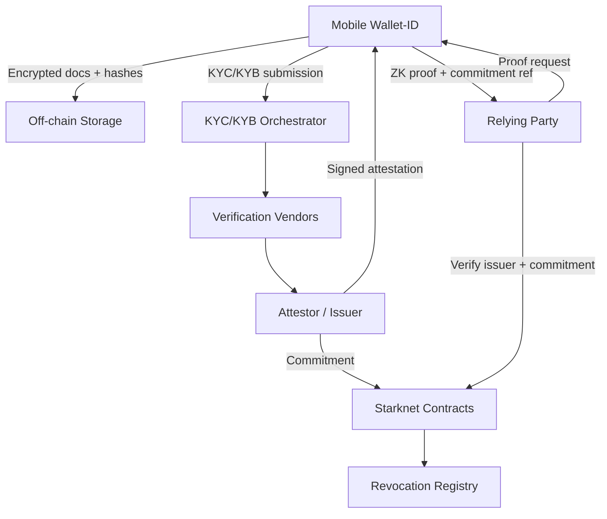
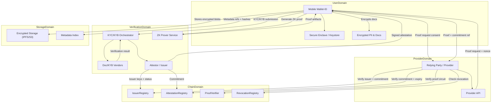
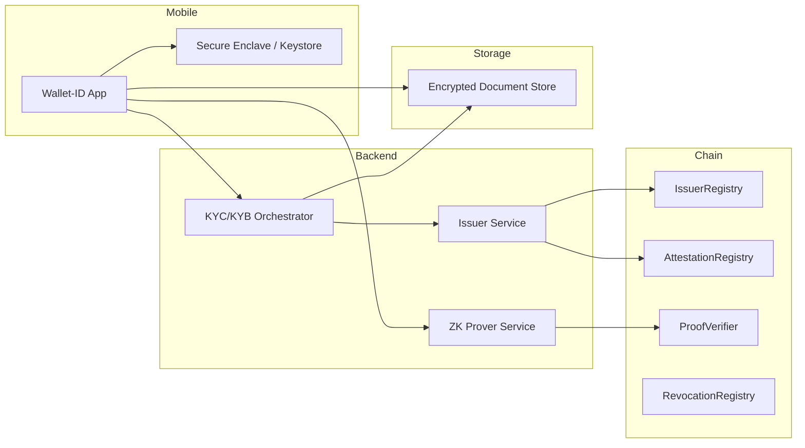

# THE OPEN ID protocol tech overview

Privacy-preserving, reusable KYC/KYB with ZK proofs and a mobile Wallet-ID. Users complete verification once, hold encrypted credentials in a wallet, and present zero-knowledge proofs to service providers. Issuers anchor attestations on Starknet for verifiability and auditability without exposing PII on-chain.

## Goals
- One-time KYC/KYB with reusable proofs
- No raw PII on-chain; user-controlled disclosure
- Verifiable by any provider via Starknet commitments
- Traceable issuer lineage and revocations
- Mobile-first wallet UX

## High-Level Architecture
1. **Mobile Wallet-ID**
   - Encrypts and stores documents locally
   - Generates ZK proofs for claims (age, residency, entity type)
   - Manages attestations and proof artifacts
2. **KYC/KYB Orchestrator**
   - Coordinates verification workflows
   - Connects to document and KYB vendors
3. **Attestor / Issuer**
   - Issues signed attestations after checks
   - Anchors commitments on Starknet
4. **Starknet Smart Contracts**
   - Issuer registry
   - Attestation registry
   - Proof verifier
   - Revocation registry
5. **Relying Parties**
   - Request proofs and verify them against on-chain state

## General Architecture (Logical)


## General Architecture (Detailed Single Diagram)


## General Architecture (Deployment)


## Critical Paths
1. **Onboarding & Attestation**
   - User submits documents -> vendor verification -> issuer signs attestation -> commitment anchored on Starknet.
   - Any break here blocks all downstream proof reuse.
2. **Proof Generation & Replay Protection**
   - Wallet generates proof bound to `request_id` + `provider_id` + `nonce`.
   - If binding is missing, proofs can be replayed across providers.
3. **Issuer Trust & Revocation**
   - Providers must verify issuer allowlist and revocation status on-chain.
   - Out-of-date issuer keys or missing revocations invalidate the trust model.
4. **Key Management**
   - Loss of wallet keys or enclave secrets means loss of access to encrypted PII and attestations.
   - Recovery flow must preserve privacy while re-binding to a new wallet.
5. **Schema / Circuit Versioning**
   - Providers must enforce accepted `schema_version` and circuit IDs.
   - Mismatched versions lead to failed verification or weak guarantees.

## Important Information (Operational)
- **PII handling**: Always encrypted at rest and in transit; never on-chain.
- **Consent**: User must explicitly approve each proof request.
- **Expiry**: Attestations must expire and be re-verified periodically.
- **Auditability**: Issuer actions and commitments are immutable and time-stamped on-chain.
- **Interoperability**: Use stable claim schemas and publish circuit specs for providers.

## Data Flow
1. User submits encrypted documents via the wallet.
2. Orchestrator verifies with vendors.
3. Issuer signs an attestation and publishes a commitment on-chain.
4. User generates a ZK proof bound to a relying party request.
5. Relying party verifies proof + issuer + commitment on Starknet.

## OpenID-Style Protocol Layer
This system is designed to be compatible with an OpenID Connect style protocol layer to make it easy for providers to integrate using standard OAuth2/OIDC flows.

### Actors
- **OpenID Provider (OP)**: the KYC/KYB service (issuer + orchestrator)
- **Relying Party (RP)**: service provider requesting KYC/KYB proof
- **User Agent**: mobile Wallet-ID

### Core Endpoints (OIDC-like)
- `/.well-known/openid-configuration`
- `/authorize` (Authorization Code + PKCE)
- `/token` (Access Token + ID Token)
- `/jwks.json` (Issuer signing keys)
- `/userinfo` (Optional; returns minimal claims or proof references)
- `/proof` (Extension endpoint to request ZK proof artifacts)
- `/attestations` (Issuer service for proofable claims)
- `/revocation` (Token/attestation revocation)

### OIDC-Compatible Flow (High-Level)
1. RP redirects user to `/authorize` with requested claim scopes.
2. Wallet approves consent and binds request to `nonce` + `state`.
3. OP issues `id_token` and access token (Authorization Code + PKCE).
4. RP validates token signature via `jwks.json` and checks `issuer`.
5. RP requests ZK proof from `/proof` or via Wallet direct channel.
6. RP verifies proof + on-chain commitment + issuer allowlist.

### Claims Model (OIDC-aligned)
- Use `claims` in the `id_token` and/or `userinfo`.
- For privacy, return **proof references** or **verified_claims** rather than raw PII.

Example `id_token` (claims reduced):
```json
{
  "iss": "https://issuer.example",
  "sub": "0xUserStarknetAddress",
  "aud": "did:provider:0xdef...",
  "exp": 1710000600,
  "iat": 1710000000,
  "nonce": "0xRandomNonce",
  "verified_claims": {
    "verification": {
      "trust_framework": "kyc_kyb",
      "assurance_level": "high"
    },
    "claims": {
      "age_over": 18,
      "residency": "US",
      "sanctions_free": true
    }
  },
  "proof_ref": "0xProofRequestId"
}
```

## How KYC Consumers Should Operate
KYC consumers (relying parties) should avoid handling raw PII and instead work with proofs and minimal claims. The recommended model is **proof-based access** with explicit user consent and strict data minimization.

### Consumer Workflow (Recommended)
1. **Request minimal claims** needed for compliance (e.g., `age_over`, `residency`, `sanctions_free`).
2. **Initiate OIDC flow** to the OP and request proof artifacts via `/proof`.
3. **Verify**:
   - Issuer allowlist and key status via `IssuerRegistry`
   - Attestation commitment via `AttestationRegistry`
   - Revocation status via `RevocationRegistry`
   - ZK proof validity via `ProofVerifier`
4. **Persist only**:
   - Proof reference ID
   - Verification timestamp
   - Issuer ID
   - Claims satisfied (boolean)
5. **Do not store** raw PII, documents, or unencrypted metadata.

### Consumer Data Handling Rules
- **Data minimization**: request only the claims needed for the specific product flow.
- **Purpose limitation**: scope claims to a single compliance purpose.
- **Retention**: store proof references and audit logs only; no raw documents.
- **User consent**: require explicit consent for every proof request.
- **Reverification**: enforce expiry and re-check revocation for each use.

### Example Consumer Audit Record
```json
{
  "customer_id": "internal-id-123",
  "proof_ref": "0xProofRequestId",
  "issuer_id": "did:issuer:0xabc...",
  "verified_at": 1710000600,
  "claims_satisfied": {
    "age_over": true,
    "residency": true,
    "sanctions_free": true
  },
  "attestation_commitment": "0xCommitmentHash",
  "revocation_checked": true
}
```

## Schemas
All schemas are JSON-compatible and stored/transported off-chain unless noted. Define claim schemas and circuit specs as versioned, provider-consumable artifacts.

### 1) Issuer (On-Chain)
```json
{
  "issuer_id": "did:issuer:0xabc...",
  "starknet_address": "0x01...",
  "public_key": "0x02...",
  "status": "active",
  "created_at": 1710000000,
  "updated_at": 1710000100
}
```

### 2) Attestation (Off-Chain Signed Payload)
```json
{
  "attestation_id": "uuid",
  "issuer": "did:issuer:0xabc...",
  "subject": "0xUserStarknetAddress",
  "claims": {
    "age_over": 18,
    "residency": "US",
    "sanctions_free": true,
    "entity_type": "LLC"
  },
  "issued_at": 1710000000,
  "expires_at": 1740000000,
  "revocation_ref": "0xRevocationHash",
  "document_commitment": "0xCommitmentHash",
  "schema_version": "1.0.0"
}
```

### 3) Attestation Commitment (On-Chain)
```json
{
  "commitment": "0xPoseidonOrKeccakHash",
  "issuer_id": "did:issuer:0xabc...",
  "subject": "0xUserStarknetAddress",
  "issued_at": 1710000000,
  "expires_at": 1740000000,
  "schema_version": "1.0.0"
}
```

### 4) Proof Request (Provider -> Wallet)
```json
{
  "request_id": "uuid",
  "provider_id": "did:provider:0xdef...",
  "required_claims": {
    "age_over": 18,
    "residency": "US",
    "sanctions_free": true
  },
  "nonce": "0xRandomNonce",
  "valid_until": 1710000500,
  "schema_version": "1.0.0"
}
```

### 5) Proof Response (Wallet -> Provider)
```json
{
  "request_id": "uuid",
  "subject": "0xUserStarknetAddress",
  "attestation_commitment": "0xCommitmentHash",
  "proof": "0xZKProofBytes",
  "public_inputs": {
    "issuer_id": "did:issuer:0xabc...",
    "claims_hash": "0xClaimsHash",
    "nonce": "0xRandomNonce",
    "provider_id": "did:provider:0xdef..."
  },
  "schema_version": "1.0.0"
}
```

### 6) Revocation Record (On-Chain)
```json
{
  "revocation_ref": "0xRevocationHash",
  "issuer_id": "did:issuer:0xabc...",
  "revoked_at": 1710000200
}
```

### 7) Encrypted Document Metadata (Wallet Storage)
```json
{
  "document_id": "uuid",
  "ciphertext_ref": "s3://bucket/path or ipfs://cid",
  "ciphertext_hash": "0xEncryptedBlobHash",
  "encryption": "xchacha20-poly1305",
  "key_ref": "local_secure_enclave_key",
  "created_at": 1710000000
}
```

## ZK Proofs
- Prove claims without revealing raw data.
- Typical claims: `age_over`, `residency`, `sanctions_free`, `entity_type`.
- Proofs should be bound to:
  - Issuer signature
  - Attestation commitment
  - Relying party request ID (prevents replay)

## On-Chain Contracts (Starknet)
- **IssuerRegistry**: allowlisted issuers + key rotation.
- **AttestationRegistry**: commitments, metadata, expiry.
- **ProofVerifier**: circuit verification and schema versioning.
- **RevocationRegistry**: revocation records or accumulator.

## Security & Privacy
- Encrypt all PII; store off-chain only.
- Bind proofs to wallet address and relying party.
- Revocations and expirations enforce validity.
- Audit trail: issuer registry + on-chain commitments.

